

  <a href="README_EN.md">English</a> | <b>繁體中文</b>

  

<h1 align="center">MqttPanelCraft (開發中)</h1>

  
  
  

  一個具備自定義畫布引擎的創新 Android MQTT 物聯網平台。 

---

## 📖 功能特性

- 🔗 **專業 MQTT 控制核心**：完整支援 MQTT 協議，具備自定義主題 (Topic) 訂閱與發佈功能，專為即時 IoT 數據傳輸設計。
- 🎨 **自主研發畫布引擎**：基於 Android Canvas API 構建的視覺化編輯器，實現高度靈活的組件配置，將創意佈局轉化為直觀的操作介面。
- 🔧 **Arduino 整合工具**：提供自動化 Arduino 範例程式碼匯出功能，大幅簡化硬體端與行動裝置間的通訊對接流程。
- 🌐 **高階 WebView 擴充**：支援嵌入自定義或 AI 生成的 HTML 原始碼，為進階使用者提供無限可能的面板客製化方案。
- 🎯 **創客與教育首選**：專為物聯網學生、開發者及愛好者設計，提供從硬體到介面開發的快速解決方案。

## 📸 螢幕截圖

<table align="center">
  <tr>
    <td align="center">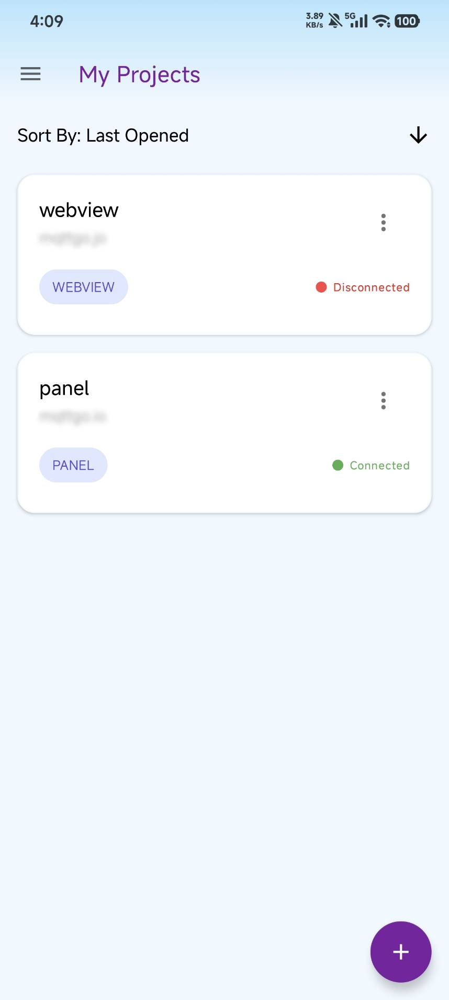 <b>主畫面</b></td>
    <td align="center">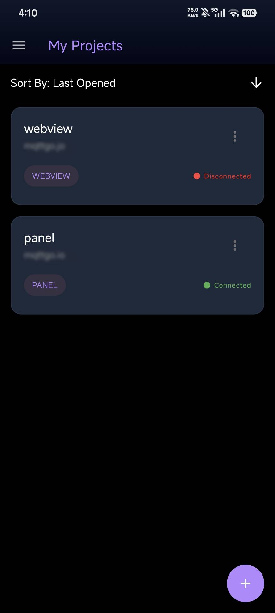 <b>暗色主畫面</b></td>
    <td align="center">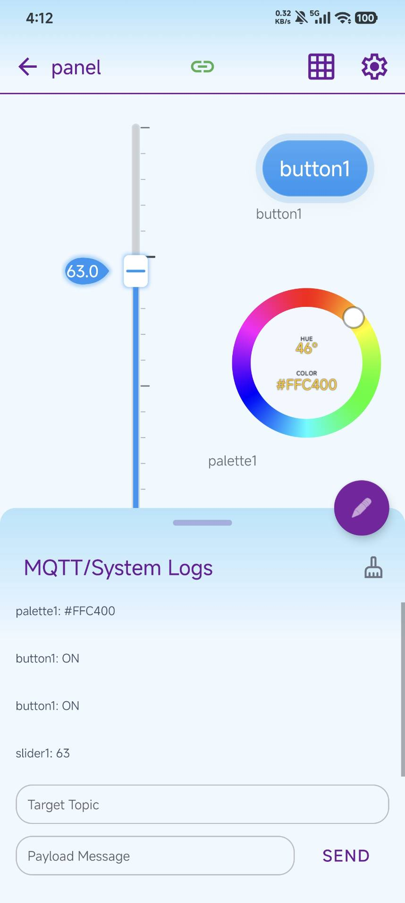 <b>畫布面板</b></td>
  </tr>
</table>

<table align="center">
  <tr>
    <td align="center">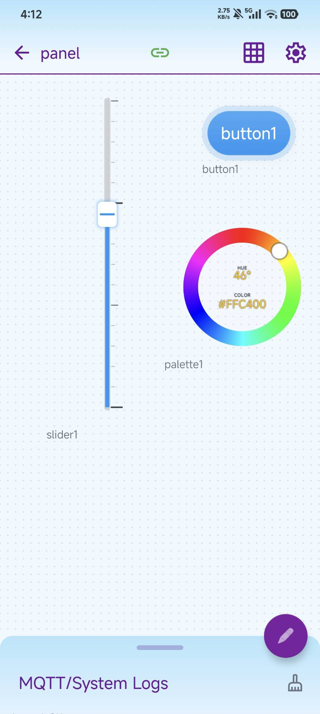 <b>畫布主畫面</b></td>
    <td align="center">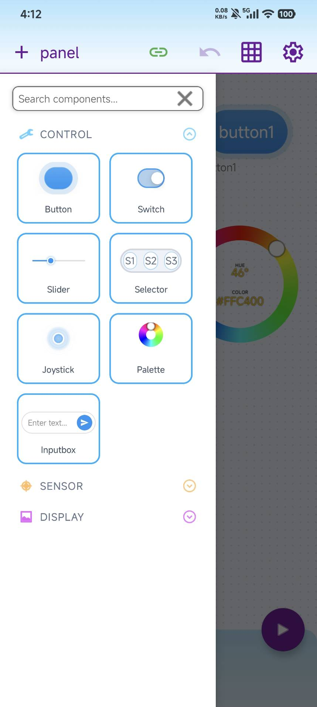 <b>元件庫</b></td>
    <td align="center">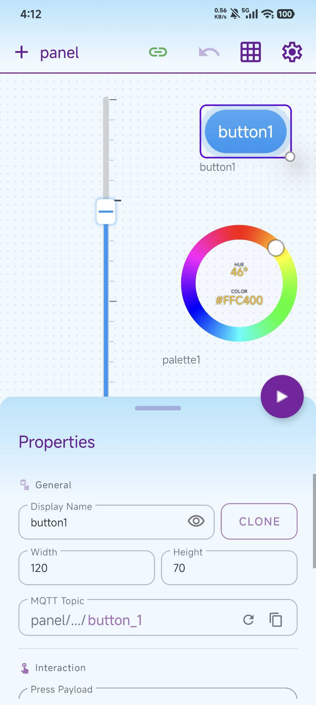 <b>元件通用屬性</b></td>
    <td align="center">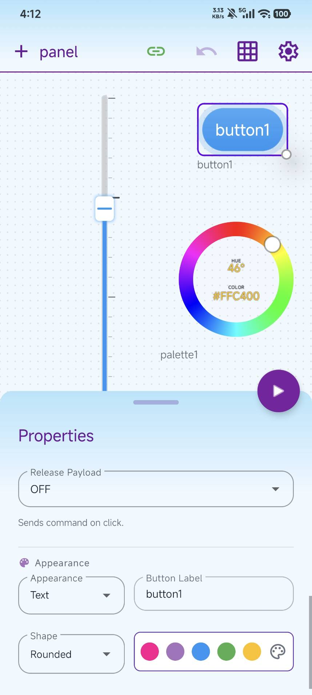 <b>元件獨立屬性</b></td>
    <td align="center">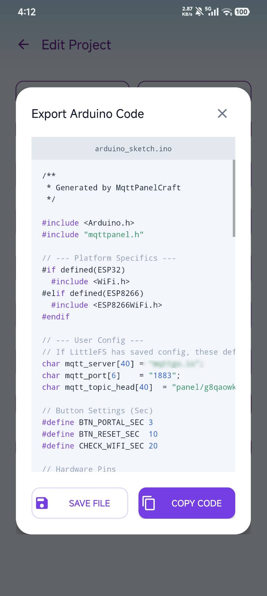 <b>Arduino code匯出</b></td>
  </tr>
</table>

  
<b>📸 查看更多截圖 (暗色模式 & 其他設定)</b>

   
  

    <b>暗色模式主題</b> 
  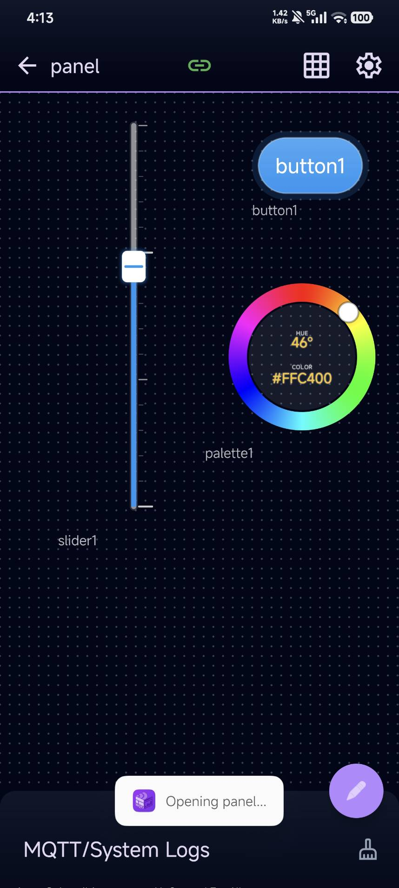
  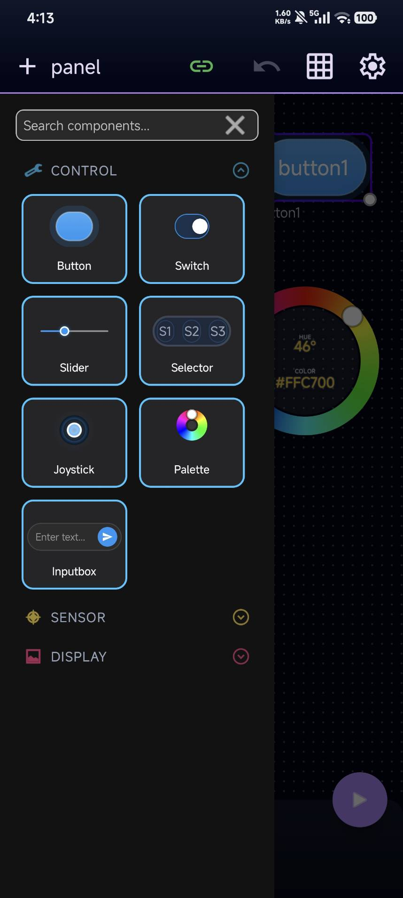
  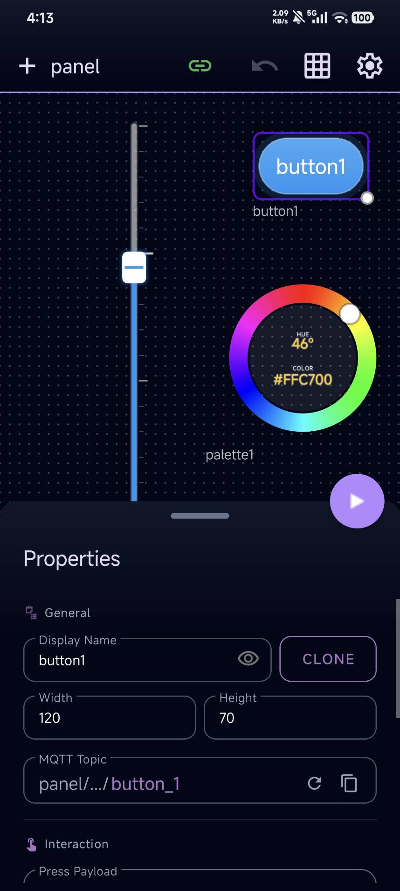
  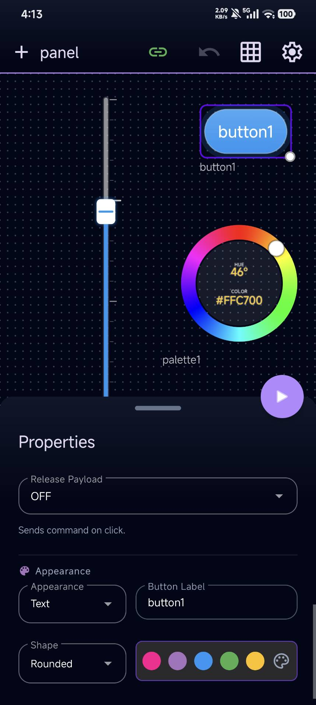
  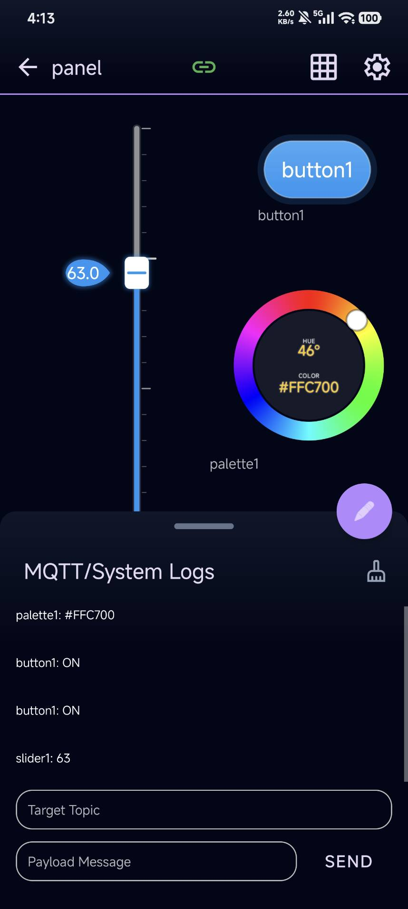
  

  

    <b>Webview 模式</b> 
    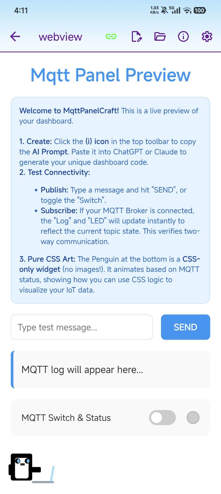
    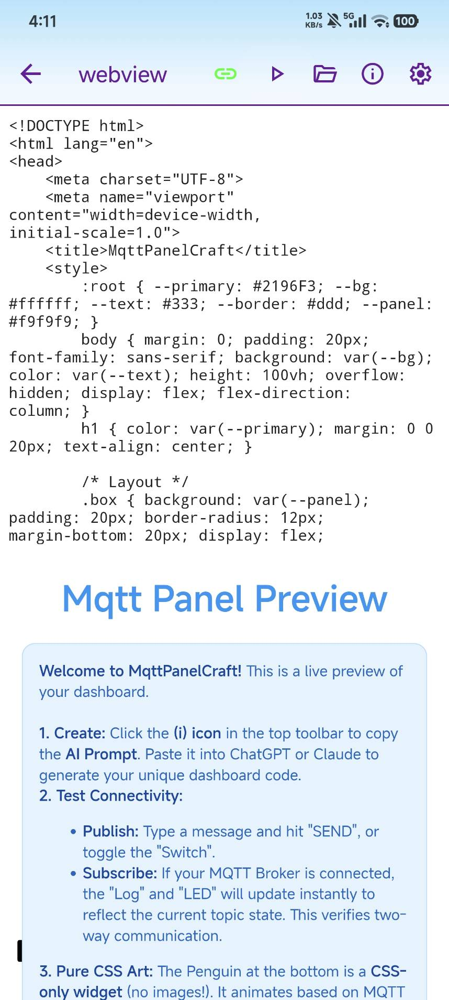
    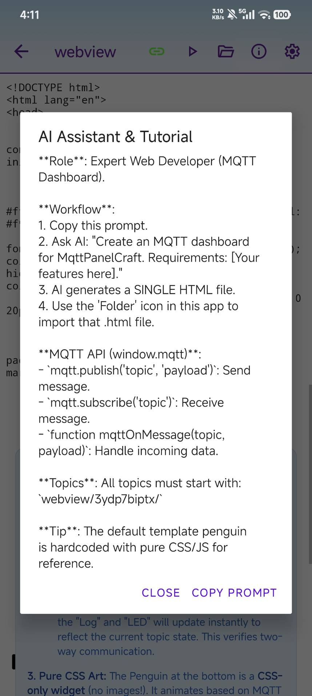
  

  

    <b>其他設定</b> 
    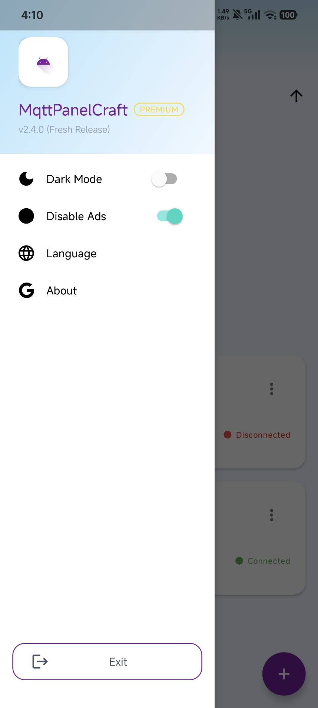
    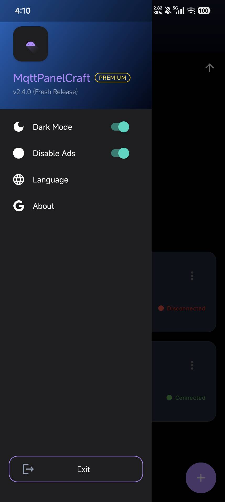
    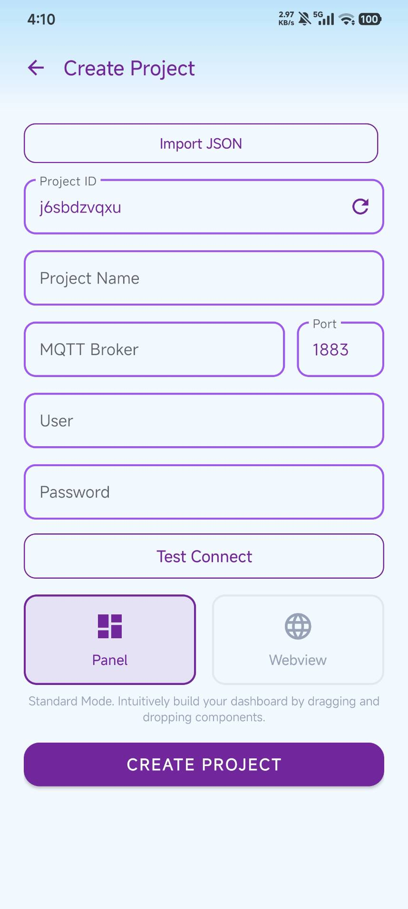
  

## 🛠️ 開發技術與工具

- **核心技術**：Kotlin (Android), C++ (Arduino 程式碼匯出邏輯), Android Canvas API (底層繪圖引擎)
- **設計架構**：MVVM 模式、Registry Pattern (組件註冊機制)、單向數據流渲染
- **通訊連線**：MQTT (QoS 1)、Foreground Service (背景通訊保護)
- **非同步處理**：Kotlin Coroutines (利用 Dispatchers 確保 UI 渲染與網路 I/O 分離)
- **混合開發**：WebView 整合、JavaScript Bridge (實現網頁與原生服務雙向溝通)
- **數據管理**：JSON 序列化 (支援專案佈局與組件設定之匯出與匯入)

## 📬 聯絡資訊

- **GitHub**: [spec127](https://github.com/spec127)
- **mail**: jinabk9112@gmail.com | vdod5404@gmail.com

---

  如果這個專案對你有幫助，歡迎給一個 <b>Star</b> ⭐

