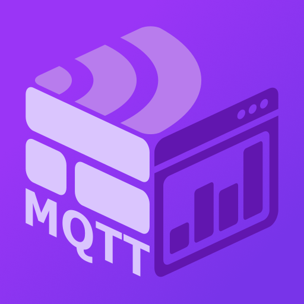

  

<h1 align="center">MqttPanelCraft (V2)</h1>

  
  
  

  一個具備自定義畫布引擎的創新 Android MQTT 物聯網平台。 

---

## 📖 功能特性

- 🎨 **自定義畫布引擎**：從零開發基於 Canvas API 的引擎，支援高度客製化的物聯網控制佈局。
- ⚡ **即時 MQTT 通訊**：優化數據交換機制，確保與設備連線的穩定度與響應速度。
- 💡 **創意實踐與自學**：展現強大的自學能力，將創新的 UI 想法與功能需求轉化為功能完備的產品。
- 🔌 **軟硬體整合**：透過 MQTT 協議輕鬆串接 Arduino 等硬體終端，實現完整的控制鏈結。

## 📸 螢幕截圖

  
  

## 🛠️ 技術棧

- **核心語言**：Kotlin (Android), C++, Python
- **架構模式**：MVVM Pattern
- **通訊協議**：MQTT, RTSP, Serial Communication
- **自動化工具**：Shell Scripting (Termux) 提升開發與維護效率

## 📬 聯絡資訊

- **GitHub**: [spec127](https://github.com/spec127)
- **LinkedIn**: [你的 LinkedIn 連結]

---

  如果這個專案對你有幫助，歡迎給一個 <b>Star</b> ⭐

